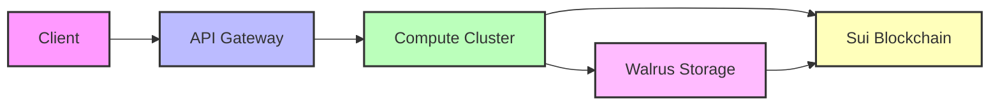

## Overview

Our AI Tools Suite provides essential infrastructure for AI developers to build and deploy models in a decentralized environment. We leverage Sui blockchain for transparent governance and payment processing, while using Walrus for efficient, decentralized storage of datasets and model artifacts. The system combines on-chain and off-chain components to deliver a practical developer experience.

## Key Features

<CardGroup cols={2}>
  <Card title="Model Training" icon="dumbbell">
    - • Distributed training infrastructure with verifiable compute resources
    - • Training metadata and results stored on Sui for auditability
    - • Model checkpoints stored in Walrus with CIDs recorded on-chain
  </Card>
  <Card title="Model Hosting" icon="cloud">
    - • Dedicated inference infrastructure with usage tracking
    - • Model versions and metadata recorded on Sui
    - • Model artifacts stored in Walrus with redundancy
  </Card>
  <Card title="Data Processing" icon="gears">
    - • Dataset preprocessing with results stored in Walrus
    - • Dataset CIDs and metadata recorded on Sui
    - • Automated format validation and conversion
  </Card>
  <Card title="Monitoring" icon="chart-line">
    - • Usage metrics recorded on Sui for transparency
    - • Resource utilization tracking for billing
    - • Cost analytics and optimization recommendations
  </Card>
</CardGroup>

## Development Tools

### Training Client

The training process leverages our compute infrastructure while maintaining transparency through Sui and Walrus:

```python
from sera.training import TrainingClient

# Initialize training client
client = TrainingClient(
    model_type="transformer",
    dataset_cid="walrus://datasets/my-dataset"  # Reference to Walrus-stored dataset
)

# Configure training
client.configure(
    batch_size=32,
    learning_rate=3e-4,
    epochs=10
)

# Start training - checkpoints stored in Walrus, metadata on Sui
training_job = client.train(
    compute_tier="gpu-standard",  # Specifies compute resources
    checkpoint_interval=1000
)
```

### Model Deployment

Model deployment occurs off-chain, but references and version history are recorded via SUI smart contracts. The model weights and artifacts are stored in Walrus:

```python
from sera.deployment import ModelDeployment 

# Deploy model using Walrus CID and Sui package reference
deployment = ModelDeployment(
    model_cid="walrus://models/my-model",  
    sui_package_id="0x...package_id",
    version="1.0.0"
)

# Configure basic scaling rules
deployment.configure(
    min_instances=1,
    max_instances=5,
    scaling_metric="requests_per_second",
    scaling_threshold=100
)

# Start deployment
deployment.start()
```

## Security Features

<AccordionGroup>
  <Accordion title="Secure Training Environment">
    - Isolated compute resources with access control
    - Encrypted data transmission between storage and compute nodes
    - Access policies validated through Sui smart contracts
    - Training logs stored in Walrus with references on Sui
  </Accordion>
  
  <Accordion title="Model Protection">
    - Model artifacts stored in Walrus with encryption
    - Access control managed through Sui smart contracts
    - Version history tracked on-chain
    - Role-based permissions enforced by smart contracts
  </Accordion>
</AccordionGroup>

## Integration Support

### Supported Frameworks
- PyTorch (model weights stored in Walrus)
- Hugging Face Transformers (model files stored in Walrus)
- ONNX format support for standardized model export

### API Endpoints

Our REST APIs provide access to the platform's core functionality:

<ResponseField name="Training API" type="POST">
  Start a new training job
  ```bash
  POST /api/v1/training/start
  {
    "model_type": "transformer",
    "dataset_cid": "walrus://datasets/my-dataset",
    "sui_address": "0x..."
  }
  ```
</ResponseField>

<ResponseField name="Deployment API" type="POST">
  Deploy a trained model
  ```bash
  POST /api/v1/deployment/create
  {
    "model_cid": "walrus://models/my-model",
    "sui_package_id": "0x...",
    "version": "1.0.0"
  }
  ```
</ResponseField>

## Available Resources

### Computing Options
<CardGroup cols={2}>
  <Card title="GPU Resources" icon="microchip">
    - • Managed GPU clusters (NVIDIA A100, A6000)
    - • Usage tracking via Sui smart contracts
    - • Pay-per-use billing with $SERA tokens
  </Card>
  <Card title="CPU Options" icon="server">
    - • General-purpose compute nodes for inference
    - • Automated scaling based on demand
    - • Resource allocation tracked on-chain
  </Card>
</CardGroup>

### Storage Architecture
- Primary storage via Walrus for datasets and model artifacts
- CIDs and metadata recorded on Sui blockchain
- Automatic garbage collection for expired data
- Content-addressed storage for deduplication

## Monitoring & Analytics

<Frame>
  
</Frame>

Our monitoring system provides:
- Real-time compute resource utilization metrics
- Training progress and model performance tracking
- Cost analysis and resource optimization insights
- Usage analytics for deployed models

### Data Flow


## Getting Started

<Steps>
  1. **Create Account**
     - Register your Sui wallet address
     - Acquire $SERA tokens for service payments
     - Set up API credentials

  2. **Install SDK**
     ```bash
     pip install sera-ai
     ```
     The SDK provides interfaces to:
     - Interact with Walrus storage
     - Manage training jobs
     - Deploy models
     - Track resource usage

  3. **Configure Access**
     ```python
     from sera import Client
     
     client = Client(
         sui_address="0x...",
         api_key="your_api_key",
         environment="mainnet"
     )
     ```

  4. **Start Development**
     - Upload datasets to Walrus
     - Train models using our compute resources
     - Deploy models for inference
     - Monitor usage and costs
</Steps>

## Pricing

Our platform uses a pay-as-you-go model with $SERA tokens:

| Resource | Unit | Price ($SERA) |
|----------|------|---------------|
| GPU Training (A100) | Hour | TBD |
| GPU Training (A6000) | Hour | TBD |
| CPU Inference | Million requests | TBD |
| Walrus Storage | GB/Month | Free |

- All costs are paid in $SERA tokens
- Storage costs are subsidized  
- Volume discounts available for enterprise users

<Note>
We're currently in beta, and features are being actively developed. Join our [Discord community](https://discord.gg/sera_gg) to provide feedback and stay updated on our progress.
</Note>