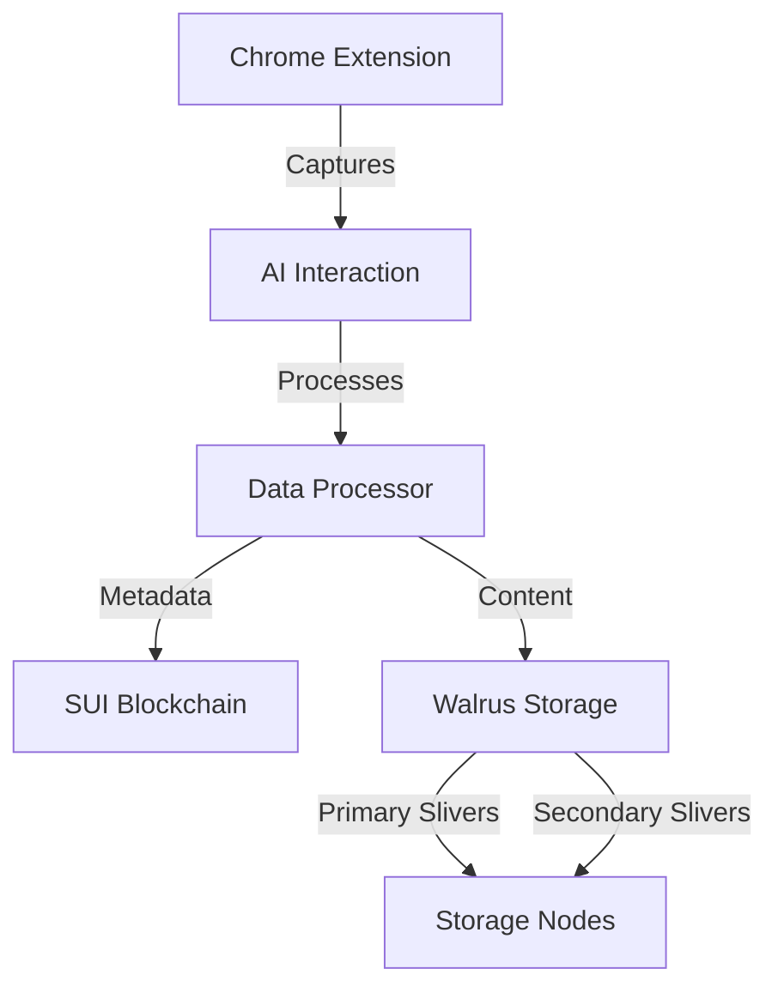

## Getting Started

### Prerequisites
<CardGroup cols={2}>
  <Card title="Chrome Browser" icon="chrome">
    Latest version of Chrome required for our browser extension
  </Card>
  <Card title="SUI Wallet" icon="wallet">
    A SUI-compatible wallet (e.g., Sui Wallet or OKX Wallet) with sufficient SUI for gas fees
  </Card>
</CardGroup>

## Installation Steps

<Steps>
  1. **Install Chrome Extension**
     Visit the [Chrome Web Store](https://chrome.google.com/webstore) and install our extension. The extension facilitates interaction with SUI smart contracts and Walrus storage protocols.

  2. **Connect Wallet**
     Connect your SUI wallet to sign transactions. You'll need a small amount of SUI for gas fees when submitting contributions.

  3. **Configure Storage Settings**
     Your AI interactions are automatically processed:
     - Metadata and verification proofs stored on SUI blockchain
     - Interaction data stored in Walrus using Red Stuff encoding
     - All storage costs covered by the protocol
     - Data split into primary/secondary slivers per Walrus spec 

  4. **Start Contributing**
     Begin interacting with supported AI models:
     - Each interaction is processed in real-time
     - Data is automatically encoded and distributed
     - Earn $SERA tokens based on quality and volu
</Steps>

## Reward Mechanism

### Technical Implementation
Rewards are calculated using verifiable on-chain parameters:

$$
R = α · Q(c) · M(t) · V(i) · (1 + B)
$$

Where:
- $α$ (alpha): Base rate defined in smart contract
- $Q(c)$: Quality score (0.1 to 1.0)
- $M(t)$: Model tier multiplier (1.0x - 1.5x)
- $V(i)$: Volume multiplier (1.0x - 1.5x)
- $B$: Bonus multipliers (referrals, streaks)

<Note>
Rewards are processed in batches aligned with Walrus storage epochs (approximately every 24 hours) to optimize gas costs.
</Note>

### Quality Guidelines

<CardGroup cols={2}>
  <Card title="Technical Requirements" icon="check">
    - • Minimum interaction length of 100 tokens
    - • Complete conversation context preserved
    - • Valid SUI transaction signatures
    - • Proper metadata formatting
  </Card>
  <Card title="Storage Violations" icon="xmark">
    - • Incomplete or truncated conversations
    - • Duplicate submissions
    - • Invalid metadata
    - • Manipulation attempts
  </Card>
</CardGroup>

## Earning Structure

### Model Tiers
<AccordionGroup>
  <Accordion title="Standard Models (1.0x multiplier)">
    Requirements:
    - Minimum interaction length: 100 tokens
    - Maximum size: 10MB per interaction
    - Standard quality checks
    
    Supported models:
    - GPT-3.5
    - Claude 3 Haiku
    - Other base-tier models
  </Accordion>
  
  <Accordion title="Premium Models (1.5x multiplier)">
    Requirements:
    - Minimum interaction length: 200 tokens
    - Maximum size: 50MB per interaction
    - Enhanced quality checks
    
    Supported models:
    - GPT-4
    - Claude 3 Opus
    - Other premium models
  </Accordion>
</AccordionGroup>

### Additional Earnings

<CardGroup cols={2}>
  <Card title="Referral Program" icon="user-plus">
    - • Earn 5% of referred users' rewards
    - • Tracked through on-chain referral smart contract
    - • Automatic distribution with main rewards
    - • No limit on number of referrals
  </Card>
  <Card title="Daily Tasks" icon="trophy">
    - • Complete daily contribution goals
    - • Bonus rewards for consistent participation
    - • Special rewards for high-quality interactions
    - • All tasks verified through smart contracts
  </Card>
</CardGroup>

## Contributor Rankings

### Performance Metrics

<CardGroup cols={2}>
  <Card title="Quality Score" icon="star">
    - • Interaction completeness
    - • Context preservation
    - • Response coherence
    - • Updated daily on-chain
  </Card>
  <Card title="Volume Score" icon="chart-line">
    - • Total daily contributions
    - • Consistency bonus
    - • Premium model usage
    - • Real-time tracking
  </Card>
</CardGroup>

## Privacy & Security

### Data Protection
<Check>Encrypted metadata using Walrus's Red Stuff encoding</Check>
<Check>Pseudonymous contributions linked only to wallet addresses</Check>
<Check>Optional data anonymization before storage</Check>
<Check>Transparent on-chain verification of contributions</Check>

### User Controls
<CardGroup cols={2}>
  <Card title="Privacy Settings" icon="shield">
    - • Choose what data to contribute
    - • Control metadata visibility
    - • Basic anonymization options
    - • Export your contribution history
  </Card>
  <Card title="Security Features" icon="lock">
    - • Standard SUI wallet security
    - • Transaction signing for all actions
    - • Activity monitoring dashboard
    - • Contribution verification tools
  </Card>
</CardGroup>

## Technical Integration

### Storage Architecture

### Implementation Details
- Data is split and encoded using Walrus's Red Stuff protocol
- Primary and secondary slivers ensure data availability
- Metadata stored on SUI blockchain for verification
- Storage costs handled by protocol treasury

<Note>
For technical details about our storage implementation, refer to the [Walrus documentation](https://docs.walrus.sui.io).
</Note>

## Support & Resources

<CardGroup cols={2}>
  <Card title="Documentation" icon="book">
    Access technical guides and API docs at docs.sera.xyz
  </Card>
  <Card title="Community" icon="discord">
    Join our [Discord](https://discord.gg/sera) for support
  </Card>
  <Card title="Updates" icon="bell">
    Follow our [Twitter](https://twitter.com/sera_xyz) for news
  </Card>
  <Card title="GitHub" icon="github">
    View our open-source components
  </Card>
</CardGroup>

<Note>
Need help? Contact our support team:
- Email: support@sera.xyz
- Discord: [Sera Community](https://discord.gg/sera)
- Technical Support Hours: 24/7
</Note>