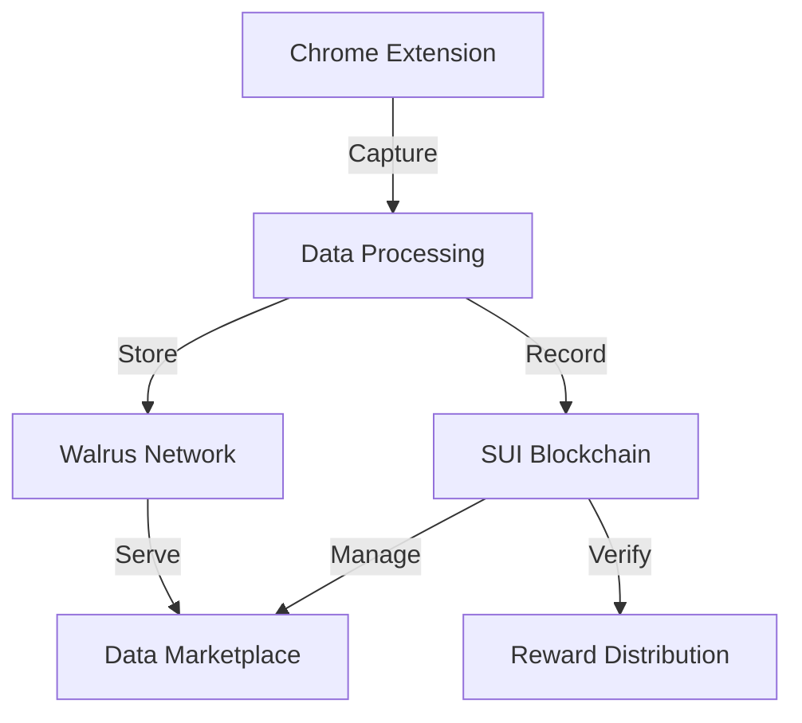

## What is Sera?

Sera is a pioneering decentralized platform running on the SUI blockchain and leveraging Walrus for distributed storage. Our ecosystem transforms how AI data is collected, managed, and monetized. By merging cutting-edge AI techniques with decentralized infrastructure, Sera enables trustless transactions, transparent governance, and verifiable data interactions, all while allowing users to profit from their contributions.

## Core Features

<CardGroup cols={2}>
  <Card
    title="AI-To-Earn"
    icon="robot"
    href="/features/ai-to-earn"
  >
    Earn $SERA tokens by contributing meaningful data and interactions to AI models. Your efforts are verified and recorded on-chain, ensuring fairness and immutability.
  </Card>
  <Card
    title="AI Data Marketplace"
    icon="store"
    href="/features/marketplace"
  >
    Decentralized marketplace for trading AI conversation data, with automated market makers and fixed-price listings secured by smart contracts.
  </Card>
  <Card
    title="AI Tools Suite"
    icon="toolbox"
    href="/features/ai-tools"
  >
    Access end-to-end AI development tools—training, hosting, and deployment—integrated seamlessly with on-chain references for configuration and governance.
  </Card>
  <Card
    title="Decentralized Infrastructure"
    icon="network-wired"
    href="/features/infrastructure"
  >
    Operate at scale with decentralized storage (Walrus) and off-chain compute resources, all orchestrated through trustless SUI smart contracts.
  </Card>
</CardGroup>

## Technical Architecture

## Quick Links

<CardGroup cols={2}>
  <Card
    title="Start Contributing"
    icon="play"
    href="/quickstart"
  >
    Install extension, connect SUI wallet, and start earning $SERA tokens for AI conversations.
  </Card>
  <Card
    title="Trade Data"
    icon="store"
    href="/guides/marketplace"
  >
    Access the marketplace to buy or sell AI conversation datasets with transparent pricing and ownership.
  </Card>
  <Card
    title="Developer Docs"
    icon="code"
    href="/technical/architecture"
  >
    Integration guides for Walrus storage, SUI smart contracts, and marketplace APIs.
  </Card>
  <Card
    title="Community"
    icon="discord"
    href="https://discord.gg/sera"
  >
    Join our Discord to connect with other contributors and stay updated on platform developments.
  </Card>
</CardGroup>

## Key Features

| Feature | Description | Technology |
|---------|-------------|------------|
| Data Storage | Distributed, fault-tolerant storage | Walrus |
| Transactions | Trustless trading and rewards | SUI Blockchain |
| Data Collection | Browser-based conversation capture | Chrome Extension |
| Market Making | Automated pricing and liquidity | AMM Smart Contracts |

<Note>
Sera focuses on creating a sustainable ecosystem where AI conversation data can be efficiently collected, stored, and traded while ensuring fair compensation for contributors.
</Note>