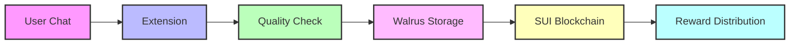

## Installation

### Browser Extension

1. **Install from Chrome Web Store**: Add the Kyne AI Data Extension from the [Chrome Web Store](https://chrome.google.com/webstore)
2. **Connect Wallet**: Link your SUI wallet to start earning from AI conversations
3. **Configure Settings**: Set your data sharing preferences and notification options

<Note>
The extension only captures AI conversations after explicit user consent and confirmation.
</Note>

## Getting Started

<AccordionGroup>
  <Accordion icon="wallet" title="Connect Your Wallet">
    Connect your SUI wallet to receive rewards and trade data:
    
    - **Sui Wallet** (Recommended)
    - **Other SUI-compatible wallets**
    
    Your wallet address will be used to:
    - Track your data contributions
    - Receive $KYNE tokens
    - Access the marketplace
  </Accordion>
  
   <Accordion icon="message" title="Contributing Data">
    1. **Enable Collection**: Toggle data collection when chatting with supported AI models
    2. **Quality Standards**:
       - Conversations must be original
       - Minimum length requirements apply
       - Automated quality checks performed
    3. **Processing Flow**:
       - Data is stored in Walrus
       - Metadata recorded on SUI blockchain
       - Rewards distributed after validation
  </Accordion>

  <Accordion icon="coins" title="Earn Rewards">
    Rewards are calculated using verifiable on-chain parameters:

    $$
    R = α · Q(c) · M(t) · V(i) · (1 + B)
    $$

    Where:
    - $α$ (alpha): Base rate defined in smart contract
    - $Q(c)$: Quality score (0.1 to 1.0)
    - $M(t)$: Model tier multiplier (1.0x - 1.5x)
    - $V(i)$: Volume multiplier (1.0x - 1.5x)
    - $B$: Bonus multipliers (referrals, streaks)

    Example Calculation:
    ```typescript
    interface RewardParams {
        baseRate: number;          // α: Set in smart contract
        qualityScore: number;      // Q(c): 0.1 to 1.0
        modelTier: number;         // M(t): 1.0x to 1.5x
        volumeMultiplier: number;  // V(i): 1.0x to 1.5x
        bonusMultiplier: number;   // B: Based on referrals/streaks
    }
    ```
  </Accordion>
</AccordionGroup>
## Data Flow


## Next Steps

<CardGroup>
  <Card
    title="Trade Data"
    icon="store"
    href="/features/marketplace"
  >
    Access the decentralized data marketplace
  </Card>
  
  <Card
    title="Developer API"
    icon="code"
    href="/technical/architecture"
  >
    Integrate Kyne into your applications
  </Card>
</CardGroup>
