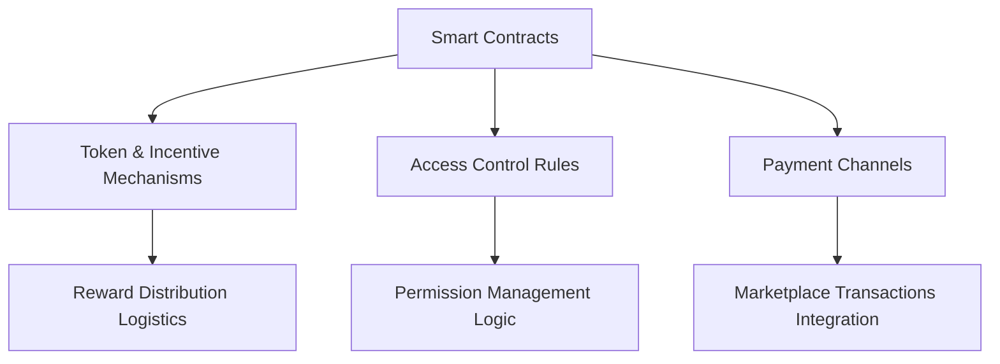
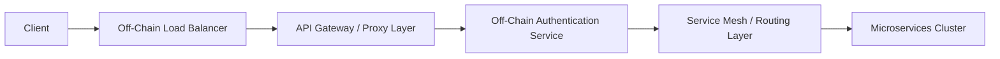

## Overview

Our architecture is anchored by the SUI blockchain’s security and verifiability, integrated with Walrus decentralized storage and established off-chain resources. The result is a robust, scalable AI infrastructure where blockchain records ensure trust, while compute and data management occur off-chain for efficiency.

## System Components

<CardGroup cols={2}>
  <Card title="Core Layer" icon="layer-group">
    - • **SUI Blockchain** for immutable asset references and governance
    - • Smart contracts for token economics and incentive mechanisms
    - • On-chain governance for community-driven parameter tuning
    - • Conversion mechanisms (off-chain points to on-chain tokens)
  </Card>
  <Card title="Storage Layer" icon="database">
    - • **Walrus Integration:** Decentralized content-addressed storage for datasets, model weights, and metadata
    - • HuggingFace model/dataset references for external hosting and versioning
    - • ChromaDB (off-chain vector database) references on-chain for indexing and retrieval pointers
    - • Off-chain distributed storage validation and replication, anchored by on-chain checks
  </Card>
  <Card title="Compute Layer" icon="microchip">
    - • Primarily off-chain compute resources (cloud providers, HPC clusters, decentralized compute marketplaces)
    - • Integration with proven decentralized computing frameworks (e.g., Golem, Bacalhau) for scaling and redundancy 
    - • Workload profiling, optimization, and fault tolerance managed off-chain, with results anchored on-chain
    - • Training and inference checkpoints stored in Walrus, with references updated on SUI
  </Card>
  <Card title="Application Layer" icon="window">
    - • Extensions and desktop apps that read on-chain references and pull data from Walrus
    - • Developer APIs/SDKs leveraging SUI smart contracts for trust guarantees and Walrus endpoints for data retrieval
    - • Integration frameworks enabling custom frontends and workflows
  </Card>
</CardGroup>

## Architecture Diagram

<Frame>
  
</Frame>

## Core Components
### Blockchain Infrastructure (SUI)
SUI smart contracts store references, manage token incentives, and govern access controls. Payments and licensing happen via on-chain transactions, while the actual data and compute remain off-chain:


### Storage System

<Steps>
  1. **Data Ingestion**
     - Content-addressed ingestion via Walrus for datasets, models
     - HuggingFace links recorded on-chain for version references
     - Checkpoint resume support for training off-chain, with references updated on-chain

  2. **Distribution**
     - ChromaDB vector indexes off-chain, with reference CIDs on SUI
     - Persistent client support ensures consistent retrieval from Walrus gateways
     - On-chain updates reflect replication and distribution statuses

  3. **Retrieval**
     - Batch queries orchestrated off-chain, guided by on-chain metadata
     - Query optimization and indexing done by off-chain services
     - Metadata management stored on-chain for verifiability

  4. **Verification**
     - Off-chain data validation processes, with proofs (e.g., Merkle roots) stored on-chain
     - Duplicate detection and quality scoring results hashed and anchored on SUI
</Steps>

### Compute Network

<CardGroup cols={2}>
  <Card title="Resource Management" icon="server">
    - • Off-chain dynamic resource allocation using cloud and decentralized compute platforms
    - • Load balancing and performance optimization strategies off-chain
    - • Resource monitoring, with summaries and SLA proofs posted on SUI
  </Card>
  <Card title="Workload Distribution" icon="network-wired">
    - • Task scheduling and job queuing handled off-chain
    - • Result aggregation performed by off-chain orchestrators, finalizing references on SUI
    - • Error handling and retries managed off-chain, with event logs hashed and recorded on-chain
  </Card>
</CardGroup>

## Security Architecture
### Data Protection

<AccordionGroup>
  <Accordion title="Encryption">
    - • End-to-end encryption before data enters Walrus
    - • Distributed key management (off-chain) with references to keys on SUI
    - • Erasure coding strategies tracked on-chain for transparency 
    - • Merkle tree-based content verification proofs
  </Accordion>
  
  <Accordion title="Access Control">
    - • On-chain role-based policies define who can request decryption keys off-chain
    - • Multi-layer permission logic combining on-chain rules and off-chain enforcement gateways
    - • Token gating ensures only rightful parties access high-value datasets
    - • Byzantine-resistant audit logs hashed and stored on SUI
  </Accordion>
</AccordionGroup>

### Network Security


(On-chain references ensure trust in these off-chain components.)

## Performance Optimization
### Caching Strategy

<CardGroup cols={2}>
  <Card title="Content Cache" icon="bolt">
    - • Distributed off-chain caching layers for frequently accessed embeddings/dataset
    - • On-chain pointers updated when cache invalidations occur
    - • Performance metrics aggregated off-chain, with summary hashes on SUI
  </Card>
  <Card title="Query Cache" icon="magnifying-glass">
    - • Query optimization done off-chain, result caching for recurrent queries
    - • Cache coherence strategies documented and anchored on-chain
    - • Analytics off-chain, integrity hashes on-chain
  </Card>
</CardGroup>

### Scaling Mechanisms

<Steps>
  1. **Horizontal Scaling**
     Add more off-chain nodes or providers

  2. **Vertical Scaling**
     Increase capabilities of existing off-chain nodes

  3. **Auto-scaling**
     Dynamically adjust resources off-chain, reflect changes on SUI

  4. **Load Distribution**
     Smart workload balancing off-chain, verified by on-chain logs
</Steps>

## Integration Points

### API Architecture

```mermaid
graph TD
    A[Client Applications] --> B[API Gateway (Off-Chain)]
    B --> C[Authentication Service (Off-Chain)]
    B --> D[Data Retrieval Service (Walrus-based)]
    B --> E[Compute Coordination Service]
    B --> F[Storage Metadata on SUI]
```

### Service Integration

<CardGroup cols={2}>
  <Card title="Internal Services" icon="gear">
    - • Off-chain service discovery mechanisms
    - • Load balancing and circuit breakers off-chain
    - • Health checks reported as aggregated metrics on-chain
  </Card>
  <Card title="External Services" icon="plug">
    - • API endpoints integrated with on-chain references
    - • Webhooks inform the chain of off-chain events (via oracles)
    - • Event streams (off-chain) with cryptographic proofs recorded on SUI
  </Card>
</CardGroup>

## Monitoring & Observability
### System Metrics

<Frame>
  
</Frame>
Off-chain monitoring tools collect logs, traces, and metrics. Periodic integrity hashes are stored on SUI for transparency and immutability.
### Logging & Tracing

```python
from sera.monitoring import Tracer

# Initialize off-chain tracer
tracer = Tracer(service_name="compute-service")

with tracer.start_span("process-job") as span:
    span.set_tag("job_id", job_id)
    # Process occurs off-chain
    span.log_kv({"event": "job_completed"})
    # Post a hash of the log to SUI for auditability
```

## Deployment Architecture
### Infrastructure as Code (Off-Chain)

```yaml
version: '1.0'
services:
  api:
    image: sera/api:latest
    replicas: 3
    resources:
      limits:
        cpu: "2"
        memory: "4G"
  compute:
    image: sera/compute:latest
    replicas: 5
    resources:
      limits:
        gpu: "1"
        memory: "16G"
```
(Actual runtime references to these infrastructures can be recorded on SUI as proof of configuration.)
### Deployment Strategy

<Steps>
  1. **Testing**
     End-to-end testing off-chain, SUI for final validation steps

  2. **Deployment**
     Blue-green or canary deployments off-chain, recorded on SUI for audit

  3. **Monitoring**
     Track performance, health off-chain; store final metrics checksums on SUI

  4. **Rollback**
     Automated rollback triggers off-chain, with related events updated on-chain
</Steps>

## Further Reading

<CardGroup cols={2}>
  <Card title="API Documentation" icon="book">
    [View API Reference](/api-reference)
  </Card>
  <Card title="Security Docs" icon="shield">
    [Security Guidelines](/security)
  </Card>
  <Card title="Integration Guide" icon="puzzle-piece">
    [Integration Patterns](/integration)
  </Card>
  <Card title="Best Practices" icon="star">
    [Development Guidelines](/guidelines)
  </Card>
</CardGroup>

<Note>
For detailed architecture discussions and technical support, join our [Developer Discord](https://discord.gg/datasphere).
</Note> 