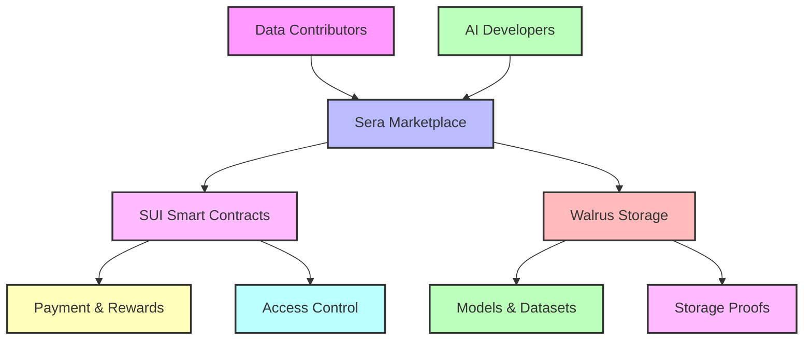

## Overview

Sera creates a decentralized AI marketplace by combining SUI blockchain's programmable transactions with Walrus's efficient storage network. This enables:

- Secure AI model and dataset trading
- Verifiable compute for AI training
- AI-to-earn incentives for data contributors
- Decentralized storage with 4-5x efficiency vs competitors

## Core Components

<CardGroup cols={2}>
  <Card title="SUI Blockchain Layer" icon="link">
    - • Handles all marketplace transactions
    - • Manages economic incentives and rewards
    - • Verifies compute results and proofs
    - • Governs protocol parameters
  </Card>
  <Card title="Walrus Storage Layer" icon="database">
    - • Stores AI models and datasets
    - • Uses Red Stuff encoding for 4-5x efficiency
    - • Ensures Byzantine fault tolerance
    - • Provides verifiable storage proofs
  </Card>
</CardGroup>

## How It Works



## Key Features

### AI Data Marketplace

<CardGroup cols={2}>
  <Card title="For Data Contributors" icon="users">
    - • Earn tokens for quality data contributions
    - • Verifiable usage tracking
    - • Revenue share from AI models
    - • Stake to earn storage rewards
  </Card>
  <Card title="For AI Developers" icon="robot">
    - • Access curated datasets
    - • Deploy models with verifiable compute
    - • Pay only for storage used
    - • Built-in monetization
  </Card>
</CardGroup>

### Tokenomics & Incentives

The protocol uses SUI's native capabilities for:

- Data contribution rewards
- Storage node staking
- Compute verification
- Marketplace fees
- Protocol governance

### Storage Architecture 

Walrus provides efficient decentralized storage through:

<Steps>
  1. **Red Stuff Encoding**
     - 4-5x more efficient than full replication
     - Byzantine fault tolerant
     - Fast recovery from node failures
  
  2. **Storage Proofs**
     - Verifiable on SUI blockchain
     - Automatic challenge/response
     - Stake slashing for violations
  
  3. **Economic Security**
     - Storage nodes stake tokens
     - Rewards for reliable storage
     - Penalties for data loss
</Steps>

## For Developers

### Quick Start

```python
from sera.sdk import SeraClient

# Initialize client
client = SeraClient(
    sui_endpoint="https://sui-rpc.example.com",
    walrus_endpoint="https://walrus.example.com"
)

# Upload dataset and create marketplace listing
dataset_id = await client.upload_dataset(
    path="./my_dataset",
    metadata={
        "name": "Training Data v1",
        "price": 1000, # in SUI tokens
        "reward_share": 0.1 # 10% to contributors
    }
)

# Deploy AI model
model_id = await client.deploy_model(
    model_path="./my_model",
    input_dataset=dataset_id,
    compute_config={
        "gpu": "t4",
        "batch_size": 32
    }
)
```

### Storage Integration

```python
# Store data with Walrus
blob_id = await client.store_blob(
    data=my_data,
    config={
        "min_nodes": 7,     # 2f+1 for Byzantine fault tolerance
        "epochs": 12,       # Storage duration
        "redundancy": 2     # Red Stuff encoding level
    }
)

# Verify storage proof on SUI
proof = await client.verify_storage(blob_id)
```

## Security Model

### Data Protection

<AccordionGroup>
  <Accordion title="Storage Security">
    - Byzantine fault tolerant with 2f+1 nodes
    - Red Stuff encoding for efficient recovery
    - Storage proofs verified on SUI
    - Stake slashing for violations
  </Accordion>
  
  <Accordion title="Economic Security">
    - Storage nodes stake SUI tokens
    - Automatic rewards and penalties
    - Market incentives for reliability
    - Governance-controlled parameters
  </Accordion>
</AccordionGroup>

### Access Control

<CardGroup cols={2}>
  <Card title="On-Chain" icon="lock">
    - • SUI smart contract permissions
    - • Token-gated access
    - • Verifiable compute results
    - • Automated payments
  </Card>
  <Card title="Storage Layer" icon="shield">
    - • Encrypted data storage
    - • Byzantine fault tolerance
    - • Storage proofs
    - • Node stake requirements
  </Card>
</CardGroup>

## Resources

<CardGroup cols={2}>
  <Card title="Documentation" icon="book">
    [Developer Docs](/docs)
  </Card>
  <Card title="Community" icon="users">
    [Discord Community](https://discord.gg/sera)
  </Card>
  <Card title="GitHub" icon="github">
    [Source Code](https://github.com/sera)
  </Card>
  <Card title="Support" icon="headset">
    [Technical Support](mailto:support@sera.xyz)
  </Card>
</CardGroup>

<Note>
Want to start earning from AI data? Join our [Discord](https://discord.gg/sera) to learn more about contribution opportunities.
</Note> 