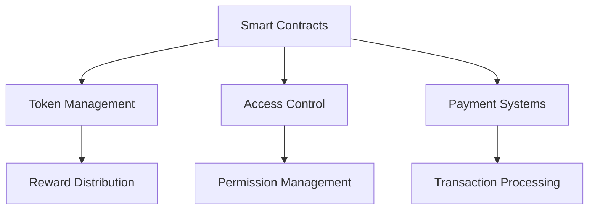
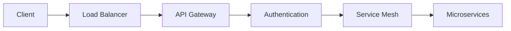
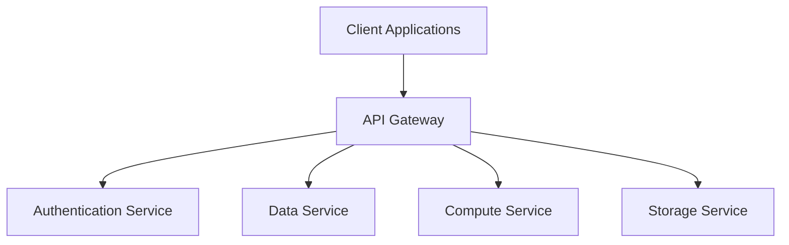

## Overview

Sera's architecture is built on a foundation of decentralized technologies, combining blockchain security with distributed computing power to create a robust and scalable AI infrastructure.

## System Components

<CardGroup cols={2}>
  <Card title="Core Layer" icon="layer-group">
    - Blockchain infrastructure
    - Smart contracts
    - Protocol governance
    - Token economics
  </Card>
  <Card title="Storage Layer" icon="database">
    - Walrus protocol
    - Content addressing
    - Data redundancy
    - Access control
  </Card>
  <Card title="Compute Layer" icon="microchip">
    - DePIN network
    - Resource allocation
    - Workload distribution
    - Performance optimization
  </Card>
  <Card title="Application Layer" icon="window">
    - APIs and SDKs
    - User interfaces
    - Integration tools
    - Development frameworks
  </Card>
</CardGroup>

## Architecture Diagram

<Frame>
  
</Frame>

## Core Components

### Blockchain Infrastructure



### Storage System

<Steps>
  1. **Data Ingestion**
     Content-addressed storage using Walrus protocol

  2. **Distribution**
     Redundant storage across decentralized network

  3. **Retrieval**
     Efficient content delivery with caching

  4. **Verification**
     Cryptographic proof of storage and retrieval
</Steps>

### Compute Network

<CardGroup cols={2}>
  <Card title="Resource Management" icon="server">
    - Dynamic allocation
    - Load balancing
    - Resource monitoring
    - Performance optimization
  </Card>
  <Card title="Workload Distribution" icon="network-wired">
    - Task scheduling
    - Job queuing
    - Result aggregation
    - Error handling
  </Card>
</CardGroup>

## Security Architecture

### Data Protection

<AccordionGroup>
  <Accordion title="Encryption">
    - End-to-end encryption
    - Key management
    - Secure key distribution
    - Encryption at rest
  </Accordion>
  
  <Accordion title="Access Control">
    - Role-based access
    - Permission management
    - Token gating
    - Audit logging
  </Accordion>
</AccordionGroup>

### Network Security



## Performance Optimization

### Caching Strategy

<CardGroup cols={2}>
  <Card title="Content Cache" icon="bolt">
    - Distributed caching
    - Cache invalidation
    - Cache warming
    - Performance metrics
  </Card>
  <Card title="Query Cache" icon="magnifying-glass">
    - Query optimization
    - Result caching
    - Cache coherence
    - Cache analytics
  </Card>
</CardGroup>

### Scaling Mechanisms

<Steps>
  1. **Horizontal Scaling**
     Add more nodes to the network

  2. **Vertical Scaling**
     Upgrade node capabilities

  3. **Auto-scaling**
     Dynamic resource adjustment

  4. **Load Distribution**
     Smart workload balancing
</Steps>

## Integration Points

### API Architecture



### Service Integration

<CardGroup cols={2}>
  <Card title="Internal Services" icon="gear">
    - Service discovery
    - Load balancing
    - Circuit breaking
    - Health checking
  </Card>
  <Card title="External Services" icon="plug">
    - API endpoints
    - Webhooks
    - Event streams
    - Integration patterns
  </Card>
</CardGroup>

## Monitoring & Observability

### System Metrics

<Frame>
  
</Frame>

### Logging & Tracing

```python
from sera.monitoring import Tracer

# Initialize tracer
tracer = Tracer(service_name="compute-service")

# Create span
with tracer.start_span("process-job") as span:
    span.set_tag("job_id", job_id)
    # Process job
    span.log_kv({"event": "job_completed"})
```

## Deployment Architecture

### Infrastructure as Code

```yaml
version: '1.0'
services:
  api:
    image: sera/api:latest
    replicas: 3
    resources:
      limits:
        cpu: "2"
        memory: "4G"
  compute:
    image: sera/compute:latest
    replicas: 5
    resources:
      limits:
        gpu: "1"
        memory: "16G"
```

### Deployment Strategy

<Steps>
  1. **Testing**
     Comprehensive testing in staging environment

  2. **Deployment**
     Blue-green deployment strategy

  3. **Monitoring**
     Performance and health monitoring

  4. **Rollback**
     Automated rollback procedures
</Steps>

## Further Reading

<CardGroup cols={2}>
  <Card title="API Documentation" icon="book">
    [View API Reference](/api-reference)
  </Card>
  <Card title="Security Docs" icon="shield">
    [Security Guidelines](/security)
  </Card>
  <Card title="Integration Guide" icon="puzzle-piece">
    [Integration Patterns](/integration)
  </Card>
  <Card title="Best Practices" icon="star">
    [Development Guidelines](/guidelines)
  </Card>
</CardGroup>

<Note>
For detailed architecture discussions and technical support, join our [Developer Discord](https://discord.gg/datasphere).
</Note> 