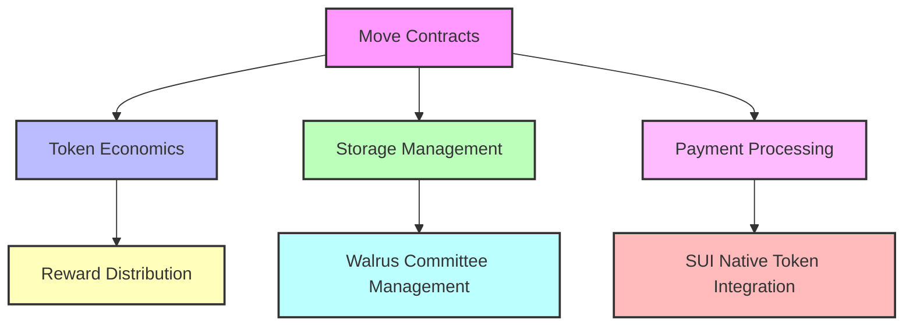
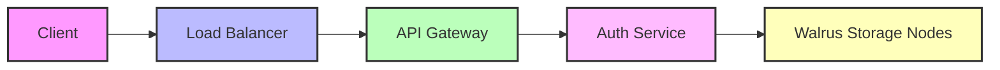
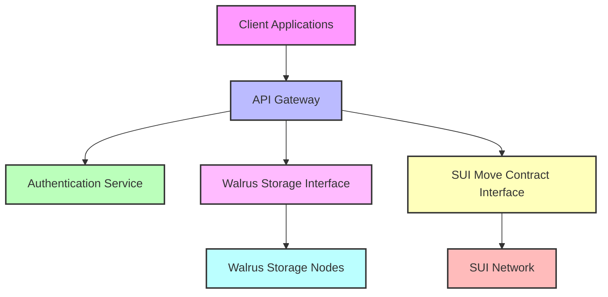

## Overview

Our architecture leverages SUI blockchain's native capabilities and Walrus storage protocol to create a practical AI infrastructure. The system uses SUI for transaction verification and governance, while Walrus handles efficient decentralized storage with its innovative Red Stuff encoding algorithm.

## System Components

<CardGroup cols={2}>
  <Card title="Core Layer" icon="layer-group">
    - • SUI Move Contracts for asset management and governance
    - • Native SUI token integration for economic incentives
    - • On-chain parameter management via SUI governance
    - • Points-to-token conversion using SUI's programmable transaction blocks
  </Card>
  <Card title="Storage Layer" icon="database">
    - • Walrus Integration: Erasure-coded storage with Red Stuff encoding
    - • Content-addressed blob storage with 2D encoding for efficient recovery
    - • Epoch-based storage committee management
    - • Storage proofs and challenges via Walrus protocol
  </Card>
  <Card title="Compute Layer" icon="microchip">
    - • Centralized compute providers with verifiable outputs
    - • Training checkpoints stored in Walrus with CID references on SUI
    - • Compute results verified through merkle proofs
    - • Job scheduling and coordination through SUI smart contracts
  </Card>
  <Card title="Application Layer" icon="window">
    - • Direct Walrus blob retrieval for efficient data access
    - • SUI SDK integration for transaction management
    - • Walrus client libraries for storage operations
  </Card>
</CardGroup>

## Architecture Diagram

<Frame>
  
</Frame>

## Core Components

### SUI Blockchain Integration
The SUI blockchain provides our foundational trust layer through Move smart contracts:



### Walrus Storage System

<Steps>
  1. **Data Ingestion**
     - Content-addressed blob storage using Red Stuff encoding
     - 2D erasure coding for efficient recovery
     - Epoch-based storage committee management
     - Storage proofs through Walrus protocol

  2. **Distribution**
     - Sliver distribution across storage committee
     - Primary and secondary sliver management
     - Automatic recovery mechanisms for failed nodes
     - Epoch-based committee rotation

  3. **Retrieval**
     - Direct blob retrieval from Walrus nodes
     - Best-effort and incentivized read paths
     - Efficient recovery using 2D encoding
     - Verification against on-chain commitments

  4. **Storage Proofs**
     - Asynchronous challenge protocol
     - Epoch-based storage attestation
     - Logarithmic scaling for proof costs
     - Byzantine fault tolerant verification
</Steps>

### Compute Network

<CardGroup cols={2}>
  <Card title="Resource Management" icon="server">
    - • Centralized compute providers with SLA commitments
    - • Verifiable computation results with merkle proofs
    - • Resource monitoring through SUI events
  </Card>
  <Card title="Workload Distribution" icon="network-wired">
    - • Job scheduling via Move contracts
    - • Result verification through merkle proofs
    - • Error handling with automatic retries
    - • Computation proof storage on SUI
  </Card>
</CardGroup>

## Security Architecture
### Data Protection

<AccordionGroup>
  <Accordion title="Encryption">
    - Client-side encryption before data enters Walrus
    - Key management handled off-chain with hash references on SUI
    - Red Stuff encoding for data redundancy and recovery
    - Merkle proofs for content verification
  </Accordion>
  
  <Accordion title="Access Control">
    - On-chain role-based access control via SUI Move contracts
    - Epoch-based committee membership verification
    - Token-gated access control for premium datasets
    - Audit logs with merkle roots stored on SUI
  </Accordion>
</AccordionGroup>

### Network Security



## Performance Optimization
### Caching Strategy

<CardGroup cols={2}>
  <Card title="Content Cache" icon="bolt">
    - • Edge caching for frequently accessed blobs
    - • Cache invalidation tracked through Walrus epochs
    - • Performance metrics with on-chain summaries
  </Card>
  <Card title="Query Cache" icon="magnifying-glass">
    - • Metadata caching with Walrus node coordination
    - • Cache coherence managed through epochs
    - • Analytics with integrity proofs on SUI
  </Card>
</CardGroup>

### Scaling Mechanisms

<Steps>
  1. **Horizontal Scaling**
     - Add more Walrus storage nodes
     - Increase committee size through governance
     - Scale API gateways independently

  2. **Vertical Scaling**
     - Upgrade storage node capabilities
     - Optimize Red Stuff encoding parameters
     - Enhance API gateway performance

  3. **Epoch Management**
     - Dynamic committee size adjustment
     - Automated storage rebalancing
     - Performance-based node selection

  4. **Load Distribution**
     - Geographic node distribution
     - Smart routing based on node health
     - Automatic failover mechanisms
</Steps>

## Integration Points

### API Architecture



### Service Integration

<CardGroup cols={2}>
  <Card title="Storage Integration" icon="database">
    - • Direct Walrus client SDK integration
    - • Blob storage and retrieval operations
    - • Epoch-based committee management
    - • Storage proof verification
  </Card>
  <Card title="Blockchain Integration" icon="link">
    - • SUI Move contract interactions
    - • Transaction management and verification
    - • On-chain event monitoring
    - • Governance participation
  </Card>
</CardGroup>

## Monitoring & Observability
### System Metrics

<CardGroup cols={2}>
  <Card title="Storage Metrics" icon="chart-line">
    - • Blob storage utilization
    - • Node health and availability
    - • Committee participation rates
    - • Storage proof success rates
  </Card>
  <Card title="Performance Metrics" icon="gauge">
    - • Read/Write latency
    - • Node response times
    - • Sliver distribution health
    - • Recovery operation stats
  </Card>
</CardGroup>

### Logging & Tracing

```python
from sera.monitoring import WalrusMonitor

# Initialize Walrus monitor
monitor = WalrusMonitor(
    storage_nodes=config.WALRUS_NODES,
    sui_endpoint=config.SUI_RPC_URL
)

# Track storage operations
async def track_storage_op():
    metrics = await monitor.collect_metrics()
    
    # Store merkle root of metrics on SUI for auditability
    await monitor.publish_metrics_root(metrics)
    
    # Alert on issues
    if metrics.node_health < HEALTH_THRESHOLD:
        await monitor.trigger_alert("node_health_degraded")
```

## Deployment Architecture
### Infrastructure Components

```yaml
version: '1.0'
services:
  api_gateway:
    image: sera/gateway:latest
    replicas: 3
    environment:
      WALRUS_NODES: ${WALRUS_NODES}
      SUI_RPC_URL: ${SUI_RPC_URL}
      
  auth_service:
    image: sera/auth:latest
    replicas: 2
    environment:
      SUI_MOVE_PACKAGE: ${AUTH_PACKAGE}
```

### Deployment Strategy

<Steps>
  1. **Pre-deployment**
     - Verify SUI Move contracts
     - Confirm Walrus node availability
     - Test storage operations
     - Validate committee membership

  2. **Deployment Process**
     - Rolling updates for API services
     - Zero-downtime infrastructure updates
     - Automatic health checking
     - Fallback procedures

  3. **Post-deployment**
     - Monitor storage operations
     - Track node performance
     - Verify committee transitions
     - Validate storage proofs

  4. **Maintenance**
     - Regular node health checks
     - Committee rotation monitoring
     - Performance optimization
     - Security updates
</Steps>

## Further Reading

<CardGroup cols={2}>
  <Card title="Walrus Documentation" icon="book">
    [View Walrus Docs](https://mystenlabs.com/walrus)
  </Card>
  <Card title="SUI Move Guide" icon="code">
    [SUI Move Reference](https://docs.sui.io/move)
  </Card>
  <Card title="Integration Guide" icon="puzzle-piece">
    [Integration Patterns](/integration)
  </Card>
  <Card title="Best Practices" icon="star">
    [Development Guidelines](/guidelines)
  </Card>
</CardGroup>

<Note>
For detailed technical support and discussions, join our [Developer Discord](https://discord.gg/sera).
</Note> 