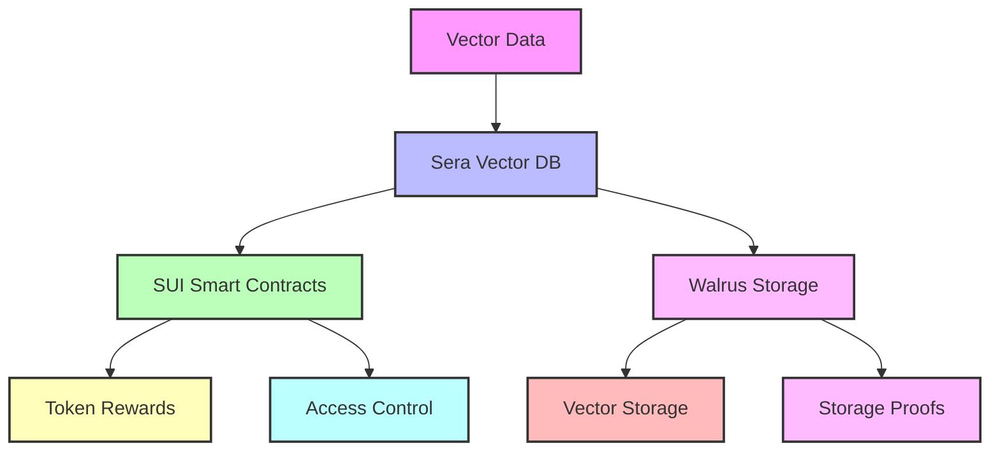

## Overview

Our vector database enables AI-powered search and similarity matching for marketplace assets while maintaining decentralization through SUI blockchain and Walrus storage. Key features include:

- Token incentives for vector data contributions
- Decentralized storage with Byzantine fault tolerance
- Built-in marketplace integration
- Verifiable search results

## Key Benefits

<CardGroup cols={2}>
  <Card title="For AI Developers" icon="robot">
    - • Build token-incentivized AI apps
    - • Access verified vector datasets
    - • Pay only for storage used
    - • Verifiable search results
  </Card>
  <Card title="For Data Contributors" icon="coins">
    - • Earn tokens for vector data
    - • Track usage and revenue
    - • Automated reward distribution
    - • Built-in data marketplace
  </Card>
</CardGroup>

## Architecture



## Getting Started

### Quick Start

```python
from sera.vector import VectorDB
from sera.wallet import SeraWallet

# Initialize with wallet for rewards
db = VectorDB(
    wallet=SeraWallet.from_private_key("0x..."),
    config={
        "reward_share": 0.1,  # Share for data contributors
        "min_stake": 100      # Min SUI tokens to contribute
    }
)

# Create collection with token incentives
collection = await db.create_collection(
    name="embeddings",
    dimension=768,
    rewards_config={
        "base_reward": 10,     # SUI per contribution
        "usage_share": 0.05    # 5% of usage fees
    }
)

# Add vectors and earn tokens
result = await collection.add(
    vectors=embeddings,
    metadata=metadata,
    stake_amount=100  # Stake SUI tokens
)
print(f"Earned rewards: {result.rewards} SUI")
```

## Vector Management

### Adding Vectors

<Steps>
  1. **Prepare Data**
     ```python
     # Stake tokens and add vectors
     await collection.add_vectors(
         vectors=embeddings,
         stake_amount=1000,    # SUI tokens
         metadata={
             "source": "training_data_v1",
             "quality_score": 0.95
         }
     )
     ```

  2. **Configure Storage**
     ```python
     # Set storage parameters
     await collection.configure_storage(
         min_nodes=7,     # 2f+1 for fault tolerance
         epochs=12,       # Storage duration
         redundancy=2     # Red Stuff encoding level
     )
     ```

  3. **Monitor Rewards**
     ```python
     # Track earnings
     stats = await collection.get_contributor_stats()
     print(f"Total rewards: {stats.total_rewards}")
     print(f"Active stake: {stats.staked_amount}")
     ```
</Steps>

### Search Operations

<CardGroup cols={2}>
  <Card title="Basic Search" icon="magnifying-glass">
    ```python
    # Search with token payment
    results = await collection.search(
        vector=query,
        top_k=10,
        payment_amount=1  # SUI per query
    )
    ```
  </Card>
  <Card title="Batch Operations" icon="layer-group">
    ```python
    # Bulk search with rewards
    async for batch in collection.batch_search(
        vectors=queries,
        reward_config={
            "per_query": 0.1,  # SUI tokens
            "bulk_bonus": 0.2  # 20% bonus
        }
    ):
        process_results(batch)
    ```
  </Card>
</CardGroup>

## Token Economics

### Reward System

<CardGroup cols={2}>
  <Card title="Contribution Rewards" icon="gift">
    ```python
    # Configure rewards
    await collection.set_rewards({
        "base_rate": 10,      # SUI per vector
        "quality_bonus": 0.2,  # 20% for high quality
        "stake_bonus": 0.1    # 10% for staking
    })
    ```
  </Card>
  <Card title="Usage Fees" icon="money-bill">
    ```python
    # Set usage pricing
    await collection.set_usage_fees({
        "query_fee": 1,       # SUI per query
        "bulk_discount": 0.2, # 20% for bulk
        "min_stake": 100     # Required stake
    })
    ```
  </Card>
</CardGroup>

### Staking Mechanics

```python
# Configure staking parameters
await collection.configure_staking({
    "min_stake": 1000,     # Minimum SUI tokens
    "lock_period": 30,     # Epochs
    "reward_share": 0.7,   # 70% to stakers
    "slashing_rate": 0.1   # 10% for violations
})

# Monitor staking returns
stake_info = await collection.get_stake_info()
print(f"APY: {stake_info.apy}%")
print(f"Total staked: {stake_info.total_staked}")
```

## Security & Performance

### Data Protection

<AccordionGroup>
  <Accordion title="Storage Security">
    - Byzantine fault tolerant storage
    - Red Stuff encoding for redundancy
    - Storage proofs on SUI blockchain
    - Stake slashing for violations
  </Accordion>
  
  <Accordion title="Access Control">
    - Token-gated access
    - Stake-based permissions
    - Verifiable query results
    - Automated reward distribution
  </Accordion>
</AccordionGroup>

### Performance Optimization

<Steps>
  1. **Query Optimization**
     - Efficient vector indexing
     - Parallel search operations
     - Result caching
     - Load balancing

  2. **Storage Efficiency**
     - Red Stuff encoding
     - Optimal chunk sizes
     - Proof verification
     - Node health monitoring

  3. **Economic Efficiency**
     - Dynamic pricing
     - Reward optimization
     - Stake management
     - Fee distribution
</Steps>

## Resources

<CardGroup cols={2}>
  <Card title="Documentation" icon="book">
    [Vector DB Guide](/vector-db)
  </Card>
  <Card title="Examples" icon="code">
    [Sample Code](https://github.com/sera/examples)
  </Card>
  <Card title="Community" icon="users">
    [Discord Chat](https://discord.gg/sera)
  </Card>
  <Card title="Support" icon="headset">
    [Get Help](mailto:support@sera.xyz)
  </Card>
</CardGroup>

<Note>
Want to earn tokens by contributing vector data? Join our [Discord](https://discord.gg/sera) to learn more about data contribution opportunities.
</Note>

